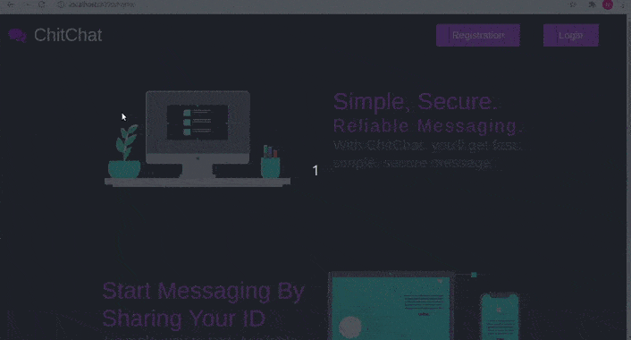

# ChitChat Web Application 

## Technology
- Backend - Django
- Frontend - Html, CSS, Tailwind CSS

With ChitChat you can talk with anyone by sharing ChitChat Id. First you have to Login/Register the sysstem. After Registering you have to enter your friends Id. After succefully entering ID you can chat with your friend on Web.

